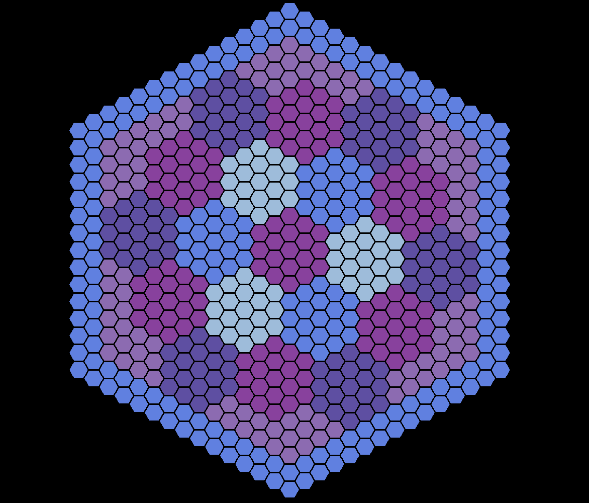

# ⬣ hexgrid ⬣

This is a tool for coloring tiles in a hex grid.



-----

## Table of Contents

- [Installation](#installation)
- [Developing](#developing)
- [Running](#running)
- [Usage](#usage)
- [License](#license)

## Installation

The build requires [hatch](https://hatch.pypa.io).

```console
hatch build
pip install dist/hexgrid-0.0.1-py3-none-any.whl
```

Alternatively, it can be run with hatch:

```console
hatch run hexgrid
```

## Developing

```console
hatch shell
```

## Running

To run with the defaults:

```console
hexgrid
```

To change the size (in pixels) of the hexagon side lengths::

```console
hexgrid -s 30
```

To change the size (in pixels) of the screen::

```console
hexgrid --screen-width 1000 --screen-height 700
```

## Usage

### Coloring a tile

The grid of colors in the top right allows you to select a color.
Clicking a hexagon in the grid will color it with the selected color.

### Adding new colors

The grid of colors below the colors used for coloring the grid is used to
add new colors to the pallet above.

Instructions:

* choose a color by selecting it
  * note that one color dimension is set to a fixed value (green upon start)
  * the color dimension with the fixed value can be modified with the "less" and "more" buttons.
  * which color dimension has the set value can be change with the "axis" button.
  * the color dimension with the fixed value can be reset to zero with the "reset" button.
* click the "frozen" button above to unfreeze the color pallet.
* click a square in the pallet above to replace it with the color selected below.

### Save an image

The "save" button will save an image of the current grid to a file named
`hexgrid_{DDDD}.png`, where `{DDDD}` is a four-digit number.

## License

`hexgrid` is distributed under the terms of the [GPL-3.0-or-later](https://spdx.org/licenses/GPL-3.0-or-later.html) license.
